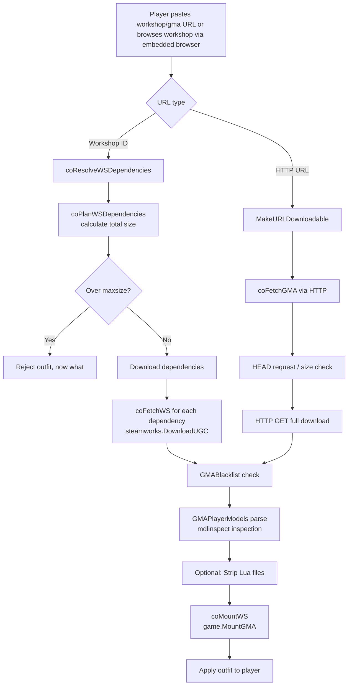

## Dependencies

| Addon | Required | Purpose |
|-------|----------|---------|
| [gurl](https://github.com/Metastruct/gurl) | Recommended | URL safety validation (`check_url_easy`) and downloadable URL conversion (`make_downloadable`) for HTTP outfits. Falls back gracefully. |
| [co](https://github.com/Metastruct/glua_utilities.git) | Yes (bundled) | Coroutine-based async flow control |
| [coext](https://github.com/Metastruct/glua_utilities.git) | Yes (bundled) | Coroutine extensions |
| [helpers](https://github.com/Metastruct/glua_utilities.git) | Yes (bundled) | General Lua utility helpers |
| [gmod-imageutils](https://github.com/Metastruct/gmod-imageutils.git) | Yes (bundled) | Image processing utilities |
| [gmod-sqliteext](https://github.com/Metastruct/sqliteext.git) | Yes (bundled) | SQLite database extensions |
| [gmod-clientchatcommand](https://github.com/Metastruct/glua_utilities.git) | Yes (bundled) | Client-side chat command handling |
| [netext](https://github.com/Metastruct/glua_utilities.git) | Yes (bundled) | Networking extensions |
| [webbrowser](https://github.com/Metastruct/glua_utilities.git) | Yes (bundled) | Embedded web browser integration |

## Developers: Mount Flow

Outfitter downloads and mounts outfits from either the Steam Workshop or HTTP URLs. The below diagram shows the full flow including dependency resolution.

### Planned extra features

- [ ] Documentation!
    - [ ] Hooks
    - [ ] High performance mode (allows preventing loading more outfits during gameplay)
    - [ ] How to enforce models on players instead of letting them decide
- [ ] Chat commands integration for admin mods
- [ ] Further protections to make things less crashy and less exploitable (10% done)
- [ ] Bodygroups support! (30% done)
- [ ] Automatic wearing of outfit on join (0% done)
- [ ] Hooks for servers to control various aspects of the addon (0% done)
- [ ] Player Appearance Customizer 3 (PAC3) linking to autowear outfit with PAC! (0% done)
- [ ] Blacklisting workshop addons based on title text (0% done)
- [ ] Ignoring players (0% done, you can ignore non-steamfriends)
- [ ] An external addon to make outfits lag-free in a VAC-safe way! (0% done)

### Planned bug fixes

 - [ ] Make blacklist less aggressive
 - [ ] Disable debug printing
 - [ ] Make certain outfits not lag when player dies 
 - [ ] Improve finding hands model for a model 
