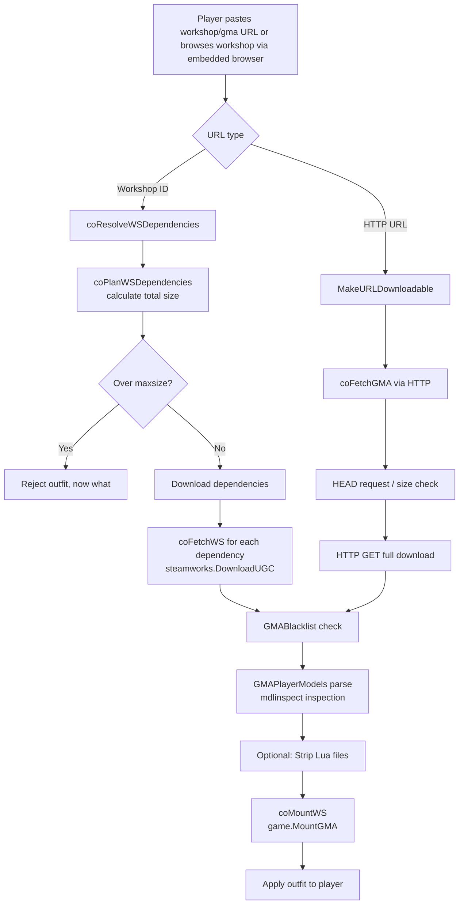

# Outfitter: Multiplayer player models

Now you can wear workshop playermodels also in multiplayer! (*Yes, others will also see what you wear, usually!*)

---

You can test the addon on [Meta Construct](http://metastruct.github.io) servers.

### Download

 - [**Steam Workshop**](http://steamcommunity.com/sharedfiles/filedetails/?id=882463775)
 - [**Git repo (amalgamation branch)**](https://github.com/Metastruct/outfitter/tree/amalgamation)

### Notice
**Although the main functionality is working many additional features are not implemented yet.**

**Known working gamemodes**
- [x] Sandbox
- [x] Base
- [X] TTT2 (partially)
- [ ] Prophunt (do not use, outfitter can be disabled!)

### How to use?

### Screenshots

## Developers: Mount Flow

Outfitter downloads and mounts outfits from either the Steam Workshop or HTTP URLs. The below diagram shows the full flow including dependency resolution.

## HTTP URL Feature

Outfitter now supports downloading outfits directly from HTTP URLs in addition to Steam Workshop.

**Supported URL providers** (auto-transformed to direct-download links):
- Dropbox (`dl.dropbox.com`, `www.dropbox.com`)
- Google Drive (`drive.google.com`)
- GitLab (`gitlab.com`)
- OneDrive (`onedrive.live.com`)
- GitHub (`github.com` blob → raw)

## Amalgamation Build

The amalgamation is a CI build process that bundles Outfitter with all its external Lua dependencies into a single self-contained branch (`amalgamation`).

## ConVars

### Client

| ConVar | Default | Description |
|--------|---------|-------------|
| `outfitter_enabled` | `1` | Toggle outfit showing on/off |
| `outfitter_download_notifications` | `0` | Show download progress notifications |
| `outfitter_fix_error_players` | `1` | Fix error player models |
| `outfitter_sounds` | `1` | Play informational sounds |
| `outfitter_hands` | `1` | Guess hands for playermodels |
| `outfitter_animfix_oldmethod` | `0` | Use fullupdate for local player animations (legacy fix) |
| `outfitter_distance_mode` | `-1` | Distance mode: -1=server preference, 0=force disable, 1=force enable |
| `outfitter_distance` | `2047` | Max distance (in units) for outfit downloads |
| `outfitter_nohighperf` | `0` | Disable high performance mode |
| `outfitter_use_autoblacklist` | `0` | Auto-blacklist outfits that crash you |
| `outfitter_allow_dependencies` | `1` | Mount selected workshop dependencies with outfits |
| `outfitter_extra_safe_downloading` | `0` | Extra safe / paranoid download mode |
| `nsfw` | `1` | Allow NSFW content (Steam text filter can still block) |
| `outfitter_download_strip_lua` | `1` | Strip Lua files from downloaded GMAs (exploit protection) |
| `outfitter_allow_http_test` | `0` | Allow HTTP downloads from outside workshop (UNSAFE) |
| `outfitter_allow_unsafe_http` | `0` | Load outfits from untrusted URLs (may leak IP) |
| `outfitter_unsafe` | `0` | Remove some outfit checks (not saved, for self only) |
| `outfitter_friendsonly` | `0` | Block outfits from non-friends |
| `outfitter_failsafe` | `0` | Ticked automatically if crash detected after applying outfit |
| `outfitter_maxsize` | `60` | Max download size (MB) for an outfit + selected dependencies |
| `outfitter_gui_focusdim` | `0` | Dim GUI when mouse leaves the window |
| `outfitter_player_menu` | `1` | Show a menu item on each player to open their outfit workshop page |
| `outfitter_disable_decompress_helper` | `1` | Disable external decompression helper |
| `outfitter_dbg` | `0` | Print debug info to console |
| `outfitter_dbg_tosv` | `0` | Send debug messages to server console |

### Server

| ConVar | Default | Flags | Description |
|--------|---------|-------|-------------|
| `_outfitter_version` | `0.11.0` | `FCVAR_NOTIFY` | Outfitter version number |
| `outfitter_sv_distance` | `1` | `FCVAR_REPLICATED, FCVAR_ARCHIVE, FCVAR_NOTIFY` | Server-side distance check suggestion |
| `outfitter_dbg` | `1` | | Server debug level |
| `outfitter_dbg_tosv` | `0` | | Debug messages to server console |

### Commands

| Command | Description |
|---------|-------------|
| `outfitter` / `outfitter_cmd` | Chat-style command: `!outfitter <id/url>`, `apply`, `cancel`, etc. |
| `outfitter_open` | Open the outfit selection GUI |
| `outfitter_about` | Open about/credits dialog |
| `outfitter_blacklist_clear` | Clear the crash blacklist |
| `outfitter_blacklist_dump` | Dump the crash blacklist |
| `outfitter_bodygroups_list` | List bodygroups for current/specified model |
| `outfitter_bodygroups_set` | Set bodygroups (e.g. `HeadAttachment=0,Backpack=2`) |
| `outfitter_skin_set` | Set skin number |
| `outfitter_camera_toggle` | Toggle thirdperson camera |
| `outfitter_testmode` | (Admin) Spawn bots with test outfits |

### Planned extra features

- [ ] Documentation!
    - [ ] Hooks
    - [ ] High performance mode (allows preventing loading more outfits during gameplay)
    - [ ] How to enforce models on players instead of letting them decide
- [ ] Chat commands integration for admin mods
- [ ] Further protections to make things less crashy and less exploitable (10% done)
- [ ] Bodygroups support! (30% done)
- [ ] Automatic wearing of outfit on join (0% done)
- [ ] Hooks for servers to control various aspects of the addon (0% done)
- [ ] Player Appearance Customizer 3 (PAC3) linking to autowear outfit with PAC! (0% done)
- [ ] Blacklisting workshop addons based on title text (0% done)
- [ ] Ignoring players (0% done, you can ignore non-steamfriends)
- [ ] An external addon to make outfits lag-free in a VAC-safe way! (0% done)

### Questions / Support / Troubleshooting

 - [https://github.com/Metastruct/outfitter/issues](https://github.com/Metastruct/outfitter/issues)

### Planned bug fixes

 - [ ] Make blacklist less aggressive
 - [ ] Disable debug printing
 - [ ] Make certain outfits not lag when player dies 
 - [ ] Improve finding hands model for a model 

### Credits

 - [Meta Construct](http://metastruct.net)
 - See ingame about dialog
 
### License

The addon and all contributions to it are licensed to Meta Construct for use as seen fit (including selling [under a more permissive license](https://creativecommons.org/licenses/by-nd/4.0/)) to ensure further development (including relicensing the whole addon and all contributions under a more permissive license such as [AGPL/MIT](https://choosealicense.com/) in the future). Meta Construct may also transfer (not duplicate) its rights.

The addon is licensed under [Creative Commons Attribution-NonCommercial-NoDerivatives 4.0 International Public License]( https://creativecommons.org/licenses/by-nc-nd/4.0/).

### Contributing

By committing you put your code under the license above.

Alternatively, declare your contributions under [Unlicense](http://unlicense.org). We will attempt to honor attribution the best we can.
